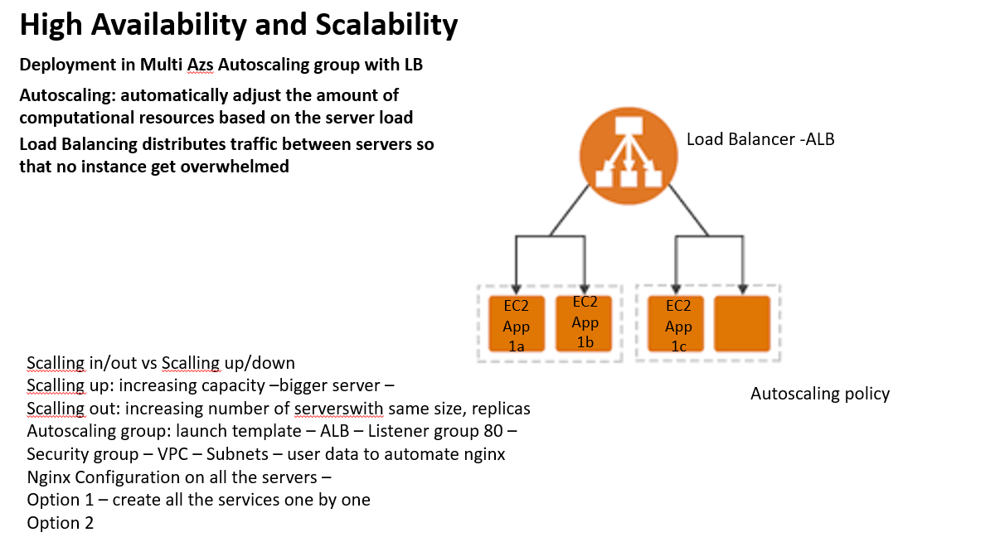

# High Availability & Scalability Deployment in Multi AZs Autoscaling group with LB SETUP



## Multi Availability Zones / High Availability
AWS has differet physical localtions around the world and these are called regions and within each region it has 2-3 availability zones which are actual physical data centers. All AZs within a single Region are connected to one another through private fiber-optic networking, allowing each AZ to communicate with one another and transfer data quickly and efficiently as required. 

## Scalability
- Vertical Scalability (scale up/down) means increasing the size of an instance eg. from t2 micro to t2 medium. This kind of scalabilty is usualy used for databases.
- Horizontal Scalability (scale in/out) means you are increasing the number of instances, so from 2 to 5. This is usually used for web applications. This is done using autoscaling groups.

## Autoscaling
Autoscaling is a service within AWS that automatically monitors and adjusts the amount of computational resources so that the app in the server is running in an optimal way. Autoscalling group will either scale out or scale in depending on demand and traffic.

## Load Balancer
A loadbalancer is a service that distributes traffic between servers so that no instance get overwelmed. It works litterally like a balance. 
There are different types of load balancers, which one to use depends on business needs:
 - Application Load Balancer (ALB), they work with internet facing app and they are the most advanced Load Balancers - layer 7 (http/https only)
 - Elastic Load Balancer (ELB)
 - Network Load Balnacer (NLB) - layer 7 (ultra high performance, TCP, usually for gaming)

## Benefits of Load Balancer
- distrubutes traffic load across different instances
- handle failure of instances (balancing the load less likely that instance fails)
- do regualr health checks of instances
- high availability across zones 

## Benefits of Elastic Load Balancer
- ELB is a manged load Balancer which means:
  - AWS gurantees that it will be working
  - AWS will take care of upgardes, maintanence and high availability
- Even though ALB is less expensive, however it takes a lot more effort on your end to maintain or integrate new updates

## Listener Group
A listener is a process that check for connection requests using the protocol and port that you configure. The rules that you define for a listener determine how the load balancer routes requests to its registered targets.


## Launch Template VS Launch Configuration


## Create Launch template
- Go to the left side and scroll down to instances
- Select "Launch Template"
- Create Launch Template if do not have one
- Name the Template "eng110-shuvo-asg-lt" use dash naming convension
- Add Tag "Name" "eng110-shuvo-asg-lt"
- Select the EC2 instance you want to use (Ubuntu)
  - if you used it recently you can select recently used machine
- Instance type
  - t2 micro
- Key pair 
   - eng119.pem
- Network settings
  - do not include subnet and security group, this will be defined in the autoscaling group
- Advanced details (scroll down to end )
- `user data` box is the provision.sh you can create a script which will be run when the instance are spinned up
   - User data (thats our provision.sh file)
``` bash
#!/bin/bash
sudo apt-get update -y
sudo apt-get upgrade -y
sudo apt-get install nginx -y
sudo systemctl restart nginx
sudo systemctl enable nginx
```
- Create Launch Template

## Create Auto Scalling Group
- Open new AWS window drop down to Auto Scalling
  - click on Auto Scaliing Groups 
- Select Create Auto Scalling Group
- name it "eng110-shuvo-asg-app"
- you can either select a launch templeate or create a launch template, we already have created one up above so we gonna select that.
- No need to do anything in the Lauch Template page press next
- Network
  - we have 3 AZs in ireland, in each AZ we have subnet(ec2)
  - select all defaults 1a, 1b, 1c and press next
- Create a Load balancer if you have not created one already
  - load balancer scheme - slect Internet facing (ALB)
- Listeners and routing
  - default routing if you dont have one create one
- Group size
   - Desired capacity 2 (24/7 there should be 2 instances running)
   - Minimum capacity 2
   - Maximum capacity 3 (if traffic increases a third one will be made available by AWS)
- Scalling policy (you can add monitoring in this section if you want otherwise you can specify later)
  - Select "Target tracking scalling policy"
  - Metric type
     - Average CPU utilization
     - target value 50
- Notification using SNS
- Add tags
   - "Name" "eng110-shuvo-resorces" this is going to be the name of your instances
- Create Auto Scalling group 

## SNS Cloudwatch CPU utilization
- Go to the ASG created previously
- Click on `monitoring` followed by `Cloudwatch` and `alarms`
- `create a new alarm`
- Select `EC2` and then the `ASG` 
- Select `CPUUtilazation`
- select `period`
- set CPU value to 50
- Create a SNS topic with tag
- Enter the email you want to be notified on
- Create dynamic scalling policy
- Select `step scalling`
- Select `Cloudwatch alarm`
- Select the action from dropdown menu
- Specify the value of capacity unit
- Specify the time the instance needs to spin up

>[AWS SNS setup](https://docs.aws.amazon.com/AmazonCloudWatch/latest/monitoring/US_SetupSNS.html)

>[SNS and cloudwatch](https://docs.aws.amazon.com/sns/latest/dg/sns-monitoring-using-cloudwatch.html)

## Four Golden Signals of Monitoring (LETS)

- Latency: The time it takes to send a request

- Errors: The rate of requests that fail, either explicitly (e.g., HTTP 500s), implicitly (for example, an HTTP 200 success response, but coupled with the wrong content), or by policy (for example, "If you committed to one-second response times, any request over one second is an error").

- Traffic: A measure of how much demand is being placed on your system, measured in a high-level system-specific metric. For a web service, this measurement is usually HTTP requests per second.

- Saturation: How "full" your service is. A measure of your system fraction, emphasizing the resources that are most constrained (e.g., in a memory-constrained system, show memory; in an I/O-constrained system, show I/O). Note that many systems degrade in performance before they achieve 100% utilisation, so having a utilisation target is essential.