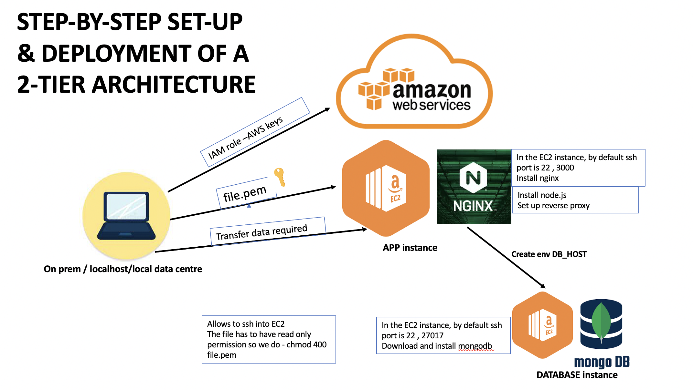

# Cloud Setup (step-by-step) - 2-Tier Architecture Set-up

## setup access to EC2(VM) on AWS
- Move `file.pem` into `.ssh folder`, located in user directory (Shuvo)
- Give read only permission to the `file.pem` - `chmod 400 file.pem` in bash terminal

## EC2 set-up on AWS
- Search and select `EC2`
- Select `launch instance`
- Select `free tier` in the redirected page
- Select the machine of interest (in our case `Ubuntu 18.04`)
- Select `t2 micro` since the app is not big only 3 pages
### Configuring instance details
- Number of Instance: 1
- Default network
- Select subnet default - DevOpsStudent - default euw ending in 1a
- Auto-assign public IP: Enable
- Leave the rest of the config the same
### Storage config
- Storage provided is more than enough
### Tag
-Add tag - `Name` `eng110_shuvo`
### Security group
- Create a new `Security Group`, if one is not already been created for the same app being deployed
- Name it and give description `eng110_shuvo_app`
- When installing nginx
  - `SSH` - default port `22` source `My IP` which is the office ip or wherever working from. Give description
  - `HTTP` - port `80` with source being `Anywhere`
  - For the app we are delivering- `Custom TCP` port `3000` source `Anywhere`
### Launch
- Choose existing key pair
- eng119 | RSA
- connect instance

## Connect to created EC2 instance
- Allow the instance to start running
- Select the created instance
- Click `connect` which will redirect you to a new page 
- Click on `SSH client` and copy the command example
- Go on your git BASH
- cd `.ssh`
- Paste `command example`
- `sudo apt-get update -y`
- `sudo apt-get upgrade -y`
- `sudo apt-get install nginx -y`
- Go to your public IP
- Copy paste url on search bar - ready to go!
## Copying file from Localhost to EC2 (2 methods)
### Method 1 
- Push your files on github repository
- cd .ssh
- Paste `command example` from EC2 instance
- git clone repository on VM
### Method 2 
- `scp -i location/file.pem -r destination/dir ec2@ip.com:source/file/or/folder`
  - `scp -i ~/.ssh/eng119.pem -r ~/Desktop/sparta_repo/cloud_computing_with_AWS/starter_code ubuntu@ec2"ipaddress found on ec2 connect page":/home/ubuntu/app`
    - SCP is secure file proxy
    - -i is for files
    - -r folders

## How to run app
- given that the following steps have been ran:
  - cd .ssh
  - Paste `command example`
  - `sudo apt-get update -y`
  - `sudo apt-get upgrade -y`
  - `sudo apt-get install nginx -y`
  - cd /app
### Install node.js
- `sudo apt install python-software-properties -y`
- `curl -sL https://deb.nodesource.com/setup_12.x | sudo -E bash -`
- `sudo apt install -y nodejs`
- `npm install`
- `npm start`
## Reverse Proxy
- If in security group (inbound rule) the port 3000 not been added upfront
  - In Security Groups, edit inbound rules
    Custom TCP, set port range to 3000, access "Anywhere"
- on VM, cd to home
- `cd /etc/nginx/sites-available`
- `sudo nano default`
- Under location add the following:
  - `location / { # First attempt to serve request as file, then # as directory, then fall back to displaying a 404. try_files $uri $uri/ =404; proxy_pass http://localhost:3000; }`

  - `location /fibonacci/ { proxy_pass http://localhost:3000/fibonacci/; }`
- `sudo systemctl restart nginx && sudo systemctl enable nginx`
- `cd app/app`
- `npm start`
### If the above commands do NOT initialise the reverse proxy do as follows
- `cd /etc/nginx/sites-available`
- Test if NGINX has any configuration errors - `sudo nginx -t` if this does not pop out any error message do as follows
- `sudo systemctl reload nginx`
- `sudo systemctl restart nginx`
- `sudo systemctl enable nginx`
- Check the status of nginx - `sudo systemctl status nginx`
- `cd app`
- `sudo apt update -y`
- `sudo apt upgrade -y` 
- `npm start`
## MongoDB set-up
- Search and select `EC2`
- Select `launch instance`
- Select `free tier` in the redirected page
- Select the machine of interest (in our case `Ubuntu 18.04`)
- Select `t2 micro` since the app is not big only 3 pages
### Configuring instance details
- Number of Instance: 1
- Default network
- Select subnet default - DevOpsStudent - default euw ending in 1a
- Auto-assign public IP: Enable
- Leave the rest of the config the same
### Storage config
- Storage provided is more than enough
### Tag
-Add tag - `Name` `eng110_shuvo_MongoDB`
### Security group
- Create a new `Security Group`, if one is not already been created for the same app being deployed
- Name it and give description `eng110_shuvo_mongodb`
- When icreating database
  - SSH - default port `22` source `My IP` which is the office ip or wherever working from. Give description
  - Custom TCP port `27017` source custome `App ip/32`
### Launch
- Choose existing key pair
- eng119 | RSA
- connect to DB instance

## Set-up mongoDB
- Allow the instance to start running
- Select the created instance
- Click `connect` which will redirect you to a new page 
- Click on `SSH client` and copy the command example
- Go on your git BASH
- cd .ssh
- Paste `command example`
- `sudo apt-key adv --keyserver hkp://keyserver.ubuntu.com:80 --recv D68FA50FEA312927` - The key for MongoDB
- `sudo add-apt-repository 'deb [arch=amd64] https://repo.mongodb.org/apt/ubuntu bionic/mongodb-org/4.0 multiverse' - The version for MongoDB`
   - in our case we used `echo "deb https://repo.mongodb.org/apt/ubuntu xenial/mongodb-org/3.2 multiverse" | sudo tee /etc/apt/sources.list.d/mongodb-org-3.2.list`
- `sudo apt update -y`
- `sudo apt upgrade -y`
- `sudo apt install mongodb-org -y` - Install the specified version of MongoDB
  - `sudo apt-get install -y mongodb-org=3.2.20 mongodb-org-server=3.2.20 mongodb-org-shell=3.2.20 mongodb-org-mongos=3.2.20 mongodb-org-tools=3.2.20`
- `sudo systemctl start mongod`
- `sudo systemctl enable mongod`
- check status to make sure `mongod` is running and active
  - `sudo systemctl status mongod`
- `cd /etc`
- `sudo nano mongod.conf` (this is a default configureation file for mongoDB)
- Go down to `network interface` the bindip does not match (because you are trying to send a request and it only accepts from the ip `127.0.0.1` which is a default ip for a windows machine, but you are sending a request from a linux form a cloud provider on aws so thats why is not letting you in) so change that to `0.0.0.0` and save it
   - we did this to ease of use, if we were in production we would put the app ip or the vbc or submit ip.
   - everytime we make a change in the configuration file or any other tool, we need to restart it to make sure it starts up with the new edits
- `sudo systemctl restart mongod`
- `sudo systemctl enable mongod`
- Check the status- `sudo systemctl status mongod`

## Connecting App EC2 to mongoDB
- Create an environment variable in the App instance - `sudo "export DB_HOST=mongodb://DB public ip address":27017/posts" >> ~/.bashrc`
  - Check if the EV has been setup - `printenv DB_HOST` or `echo $DB_HOST`
  - in production we use the private ip because we wont have the public ip
- 2 ways to get the above function to start working:
  - exit out and then exit in 
  - or `source ~/.bashrc` (source means refresh this terminal)
- `npm start`
- Type `node seeds/seed.js` (this command goes and connects to the database and reads the database seeds the database)
- `npm start` (this way should work)

## Possible errors and solution
error - throw ER unhandled error event address already in use 3000
solution - `ps aux` - look for node find the node and copy the PID(process ID) and do "sudo kill PID"

## EXTRA
- to see if the instance can connect we can try - `telnet` `the ip address we are trying to connect`
- there are different ways to connect servers rather then using env var, you can use apis, aws services, creating pipeline

