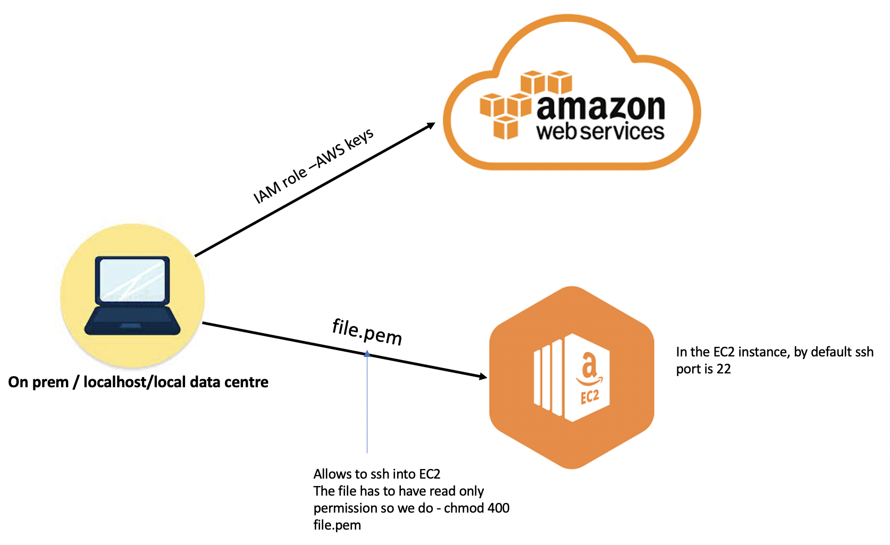

# Cloud Computing with AWS 

Keywords:
- AWS - Amazon Web Services
- EC2 - Elastic Compute sercise
- IAM - Identity Access Management
- AZs - Availability Zones
- prim - local host/ physical building
- capital expenses -
- operational expenses - 
- EBS - Elastic Block Storage

## What is Cloud Computing?
Are services offered by third party companies to run virtual instances of physical hardware as a service that you as  customer, organization or individual can use instead of using your own hardware and operating system. It allows more flexibility on operating system where we can configure a system and rent them by specifing things like the OS, RAM, storage. 
Cloud computing is a pay as you go services, making the service cost effective.

## Why Cloud Compting (benefits)?

- Security 

- Cost 

the key benefit of Cloud Computing in terms of cost element is, you can never 100% predict the traffic.

e.g.(how is it cost effective)
Usually in Retail, yearly, it is expected that there will be a 10% increase in traffic.They have 2 servers, lets say the servers can handle 100M users.Therefore, if there is an increase in number of users, the comapny will buy upfront a new server/ building/ machine to host the new number of customers. For that building, they have to have a security guard, lock, electricity etc... so no return yet. So they invested that money in and they succesfully served all the new customers. During december they have high volume due to Xmas. However, when January comes the number of customer decreases drastically, but the hardware that was purchased is not being fully used. However, the cost in running is still there you still have to pay for security, electicity etc.. so it is not cost effective. So instead of investing on physical infrastructure, we take it on cloud we can increase the number of servers in demand and decrease it when this is less demand, which makes it cheaper. Nothing had to be built or bought, we just rented space that someone else has built.

## difference between Regions and AZ.
one region must have at least 2 availability zones minimum. Regions are geographical location where Amazon/ microsoft store their Data Centers which they use to provide their services. 

## AWS
https://aws.amazon.com/about-aws/global-infrastructure/

## Why use multiple AZs?
We use multiple AZs as a backup (disaster recovery) incase anything happens because you can never predict a disaster (earthquake, flood). So when deploying an App in different AZs if one of the AZ goes down AWS services will check the API status code 200. if the status code is not 200 the traffic will automatically redirected to the other AZ while AWS fixes the issue of the unresponsive instance/database. As soon as it becomes available, AWS will automatically go back to normal, dividing the resources again. you can also have multi region. More AZs means more cost. 

When chossing the region we have to think about the end user. The app should be deployed in a region closer to the end user region, so we should rent sapce nearest to the users. This is so we can prevent any lettency, up time, the repsonse time can be faster and easily achieved.

## Create a service (create a virtual machine online on a public cloud) 

-eng119.pem move to .ssh folder on local machine 
-prem/localhost/ local data center
- file.pem allows to ssh inside the machine
- ssh - chmod 400 file.pem
- ports -80 - 3000

