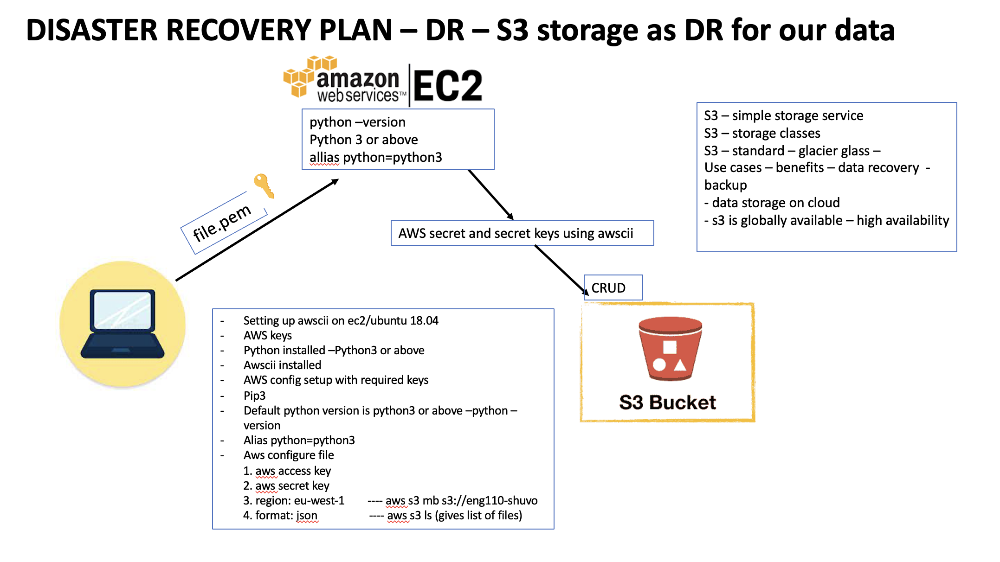

# Simple Storage Service (S3 Bucket)
- S3 is a storage, where you can store the data, read the data, transfer the data. Depending on what type of database you are using has to be in a specific format. If your are using JSON the data has to bo in json format, Excel the data has to be in the Excel format. So any provider that is giving as a facility to store the data, is resticting us on how to write the data. The beauty of S3 is that it does not ask you what type of data you want to store, which means anything can be stored in the bucket.

## why should we use it
- flexibility
- cost effective

## S3 Classes
- Standard Class
- Glacier Class (less expensive)
- We choose the Class depending on the business case and usage, how frequently you need to access the data.
- eg. We all work for an Employer, and the employer has my data, your data, passport, NI all sort stored somewhere. So if they are requested from a bank, morgatge provider or whoever applys for the reference, the employer will provide the info. So the data is active everyday as you are working and using your credentials, the data is being accessed all the time. However, ex-employes who dont work for the company any longer, by law employers have to keep the records of ex employees for 5-7 years and that data is not frequently accessed but maybe needed. The employees may request a reference, like date of leaving and position, that data is ideal to be saved in a Glacier Class because is more economical. Anything you save in glacier you need 24-48 hrs of notice to retrive the data.

## S3 set-up

- A S3 bucket can be either created on an EC2 instance or just on its own
- If you set-up the S3 bucket on an EC2 instance to access it, you are required to provide access and secret keys using AWS CLI (comand line interface)
- Spin up an EC2 instance
- On AWS search bar look for S3 (the database on s3 is globally available)
### install AWS CLI
- ssh into the EC2
- check dependencies `python --version`
- Install python v3 or above `sudo apt install python3`
- because we have multiple versions of python available inside the instance, we want to let the OS know which version to use `alias python=python3` to make it permanent we can put it into the .bashrc file
- Install pip `sudo apt install python3-pip -y` this work as well `sudo apt install python-pip -y`
- Install AWS CLI `sudo python3 -m pip install awscli` or `sudo python -m pip install awscli` or `sudo pip3 install awscli` 
- *NOTE* use python3 and pip3 to be safe 
- ADD KEYS - to add keys `aws configure`
 - copy paste `access key`
 - copy paste `secret key`
 - region name `eu-west-1`
 - output format `json`
### AWS CLI commands for S3
- to check available s3 buckets `aws s3 ls` where running the command `aws` which service `s3` what is the instruction `ls`
- Create a bucket `aws s3 mb s3://bucket-name` mb stands for make bucket, the path s3://, naming convention you cannot use underscore and special letters only letters numbers and dashes
- Go on S3 on AWS and check the bucket
- Create a file using either `sudo nano` or `sudo vi`
- copy file from EC2 to S3  `aws s3 cp name_file s3://bucket_name`
- Download file from S3 to EC2 `aws s3 cp s3://bucket-name/test.txt test.txt`
You cannot delete a bucket that has content in it
- so you either manually go empty the bucket and run `aws s3 rb s3://bucket_name`
- or `aws s3 rm s3://bucket_name/ --recursive` and then `aws s3 rb s3://bucket_name`
## How did you secure the keys
- I secured the keys using aws configure
- we can secure the keys by incrypting it in python,in awscli, creating ansible vault

## Create Read Update Delete (CRUD)

## Online resources/links

>[AWS S3 docs](https://docs.aws.amazon.com/cli/latest/reference/s3/)

>[AWS CLI commands for S3](https://docs.aws.amazon.com/cli/latest/userguide/cli-services-s3-commands.html#using-s3-commands-delete-buckets)

>[Boto3.py AWS code samples for CRUD](https://docs.aws.amazon.com/code-samples/latest/catalog/python-greengrass-snippets-iot_data_client_boto3.py.html)
