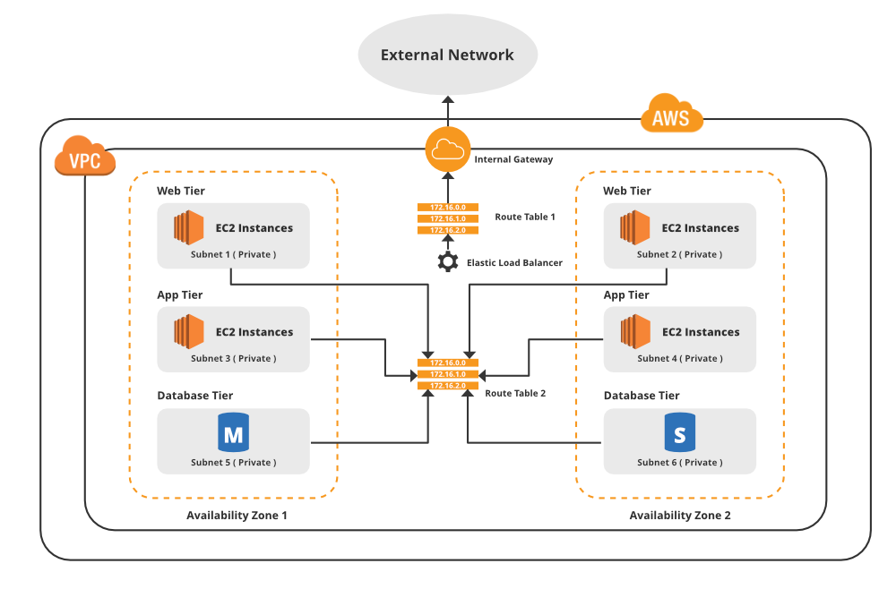
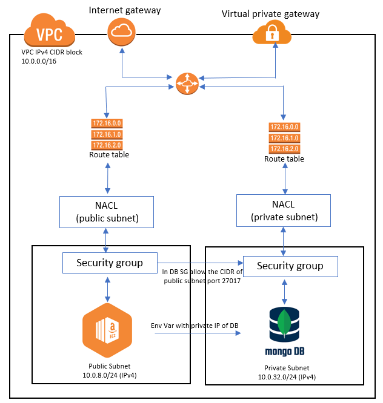

## VPC
- Virtual Private Cloud (VPC) is the networking layer for Amazon Elastic Compute Cloud (Amazon EC2) and provides a private, isolated section of the AWS Cloud where you can launch AWS services and other resources in a virtual network.

## Why we need VPC
- When we create a service on the cloud they are open to the world, anyone can access it which makes it vulnerable to attacks  from the outside. VPC is there in order to protect the service by only allowing specific IP addresses.

## Internet Gateway
- the internet gateway connects the VPC to the internet so that the instances can access it 

## Route table
- A route table contains a set of rules that directs the traffic between the internet gateway and subnet.

## Subnets
Subnet is a range of IP addresses in the VPC. We can launch AWS resources, such as EC2 instances, into a specified subnet. When we create a subnet, we specify the IPv4 CIDR block for the subnet. Each subnet must reside entirely within one AZ. By launch instances in separate AZs, we can protect our services from the failure of a single zone.

## CIDR Block
Classless Inter-Domain Routing (CIDR) is a method for allocating IP addresses by giving a range of useable IP addresses /32 or /16.

## Subnet Mask
A subnet mask is a number that distinguishes the network address and the host address within an IP address

## what is an IP
- IP is short for internet protocol. An internet protocol is essentially a unique number that allows our devices to communicate with each other

## IP network
- An IP network refers to any group of devices, each with their own unique IP addresses, connected under the same network topology. Devices connected to a shared IP network can send and receive information. 

- A private IP network allows data to be shared between connected devices securely, by enforcing password protected connectivity that allows only those devices in your office or home to access the IP network

## NACL
- Network Access Control List is essential a fireawall around subnets that protects them fro unwated external attacks. 

## NACL vs Security Group
- NACL and Security Groups are both firewalls, however NACL is a firewall for the VPC subnets whereas security group is a firewall around the instance. 
- when setting up an NACL you have to specify bot ingress and egress rules making it stateless, whereas in security group you only specify the ingress rule, the egress rule is allow all, which makes it stateful

## Statefull vs stateless
- A STATELESS process can be understood as a process where there is no data or reference to previous transaction are being stored 

## VPC setup
- On the AWS Dashboard search for `VPC` and click on `Your VCP`
- Select `Create VPC`
- Create a `Name tag`
- Add an IPv4 CIDRblock (10.0.0.0/16) and click `Create VPC`

## Internet Gateway
- Select `Internet Gateways` on the dashboard then select `Create Internet gateway`
- Add a `Name tag` then click `Create Internet Gateway`
- Select `action` and Attach VPC
- Attach the VPC you created previously
- Select `Attach` Internet Gateway

## Subnet 
- Click on `Subnet` on the left tool bar then select `Create subnet`
- Create a public, private and bastion subnet:
- Select the VPC you previously created
   - Public: CIDR block IP changes slightly by adding 1 instad of 0 in the 3rd optec (10.0.1.0/24)

## Private Subnet
- Click Create subnet
- Choose the correct VPC ID (the one you set up)
- Choose a Subnet name with appropriate naming conventions (for example eng110-shuvo-psn).
- For the IPv4 CIDR block, put in 10.0.32.0/24.
- For routes, put in 0.0.0.0/0 and as a Target put in the app instance's Network interface ID (for example eni-08158edf754bab170).

## Route Table
- On the left hand toolbar click on `route table`
- `Create a route table`
- Name route table
- select VPC created previously
- add tag
- `Create route table`
- Select the `route table` and click `Action` then `Edit routes`
- `add route`
- Then add a destination and target
  - The destinaton is the world (0.0.0.0/0)
  - The target I used was the internet gateway created earlier. Then click save routes
- Scroll down and click on `subnet associations`(to connect route table to subnet)
- `edit subnet associations` select the subnet, this will give connectivity to the internet

## Create NACL
- On the left hand side toolbar under security click on `Network ACLs`
- Click create network ACL
- Create a public & private NACL and select your VPC

## launch
- Choose the DB ami
- security group, source TCP and port range 27017. For the source, choose the CDIR address from your public subnet (for example 10.0.1.0/24). Also choose 22 with your ip
- In your app instance, use the sudo echo "export DB_HOST=mongodb://your_db_ip:27017/posts" >> ~/.bashrc and replace your_db_ip with the Private IPv4 Address of your DB instance
- In the app instance, do cd /app and run npm start

